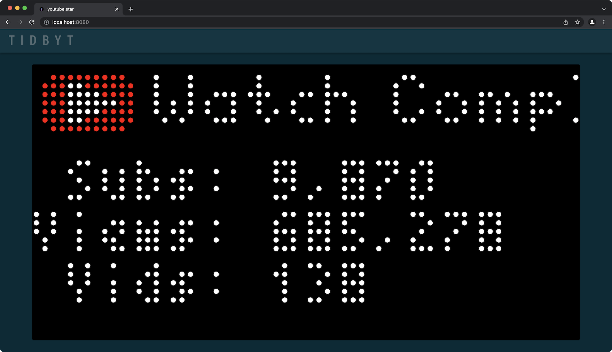
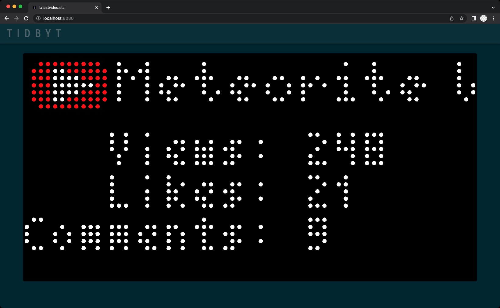

# Tidbyt-YouTube

[Tidbyt](https://tidbyt.com/) integration with the YouTube API. You simply need to replace the CHANNEL\_ID and API\_KEY with your values.

The default YouTube applet for Tidbyt did not have the detail I wanted, nor did they open source it, so here are alternate versions. Both **YouTube** and **LatestVideo** include horizontal scrolling for the channel name and video name, respectively.

Starlark, and more specifically `pixlet 0.16.0` does not support external files, libraries, string formatting, or some other basic functionality so I wrote my own comma insertion function. Beginning with `pixlet 0.17.0` the module "humanize" can be used for formatting some basic data types, so below I provide a code example for using their comma function instead of mine.

| Channel Stats | Latest Video |
:-------------------------:|:-------------------------:
|  |  |
 
## Static

 <i>Latest Video Details</i>

## Animation

 <i>YouTube Channel Details</i>

## Humanize Alternative
Humanize is perhaps the worst name for code module...but anyway you could remove my comma function and do the following instead. Requires Pixlet version 0.17.0 or higher.

At the top of the file with the rest of the modules make sure you load "humanize".
<pre>load("humanize.star", "humanize")</pre>

And then for the value do something like this.
<pre>subs = int(YouTubeData.json()["items"][0]["statistics"]["subscriberCount"])
subs = humanize.comma(subs)
</pre>